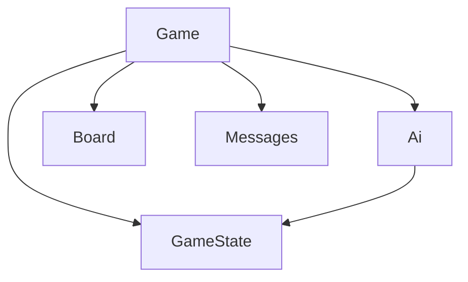

TicTacToe Game

This application runs over Node.js v10.16.3


```mermaid
graph TD;
    Game --> GameState;
    Game --> Ai;
    Game --> Board
    Game --> Messages
    Ai --> GameState
```

To run:
```
npm start
```
or
```
node ./dist/main.js
```

Note: You need to build first before running
```
npm run build
```
